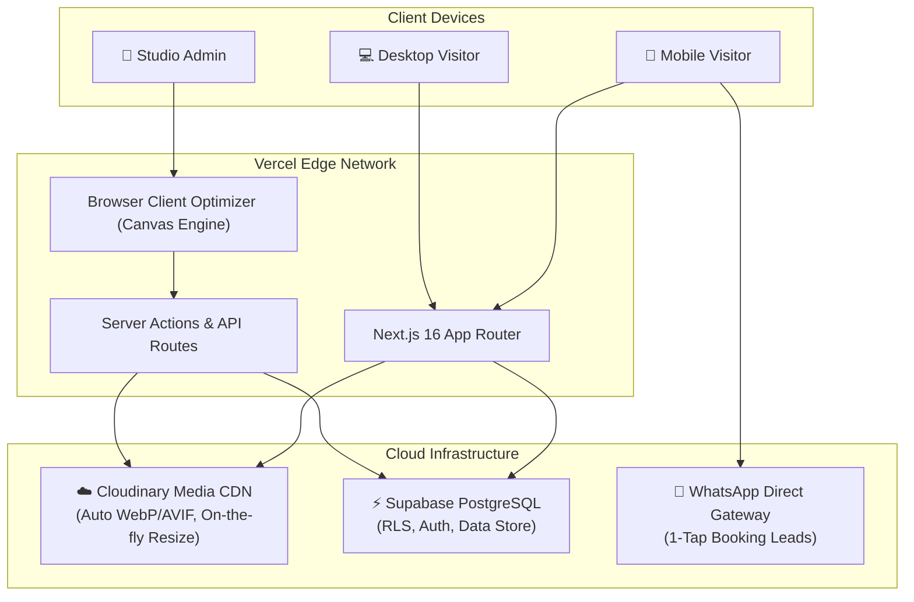
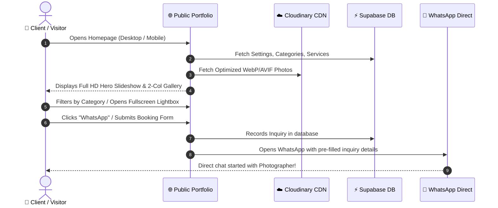
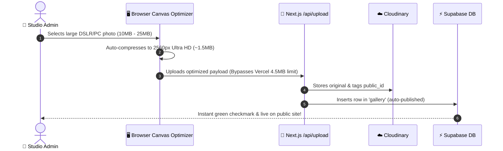
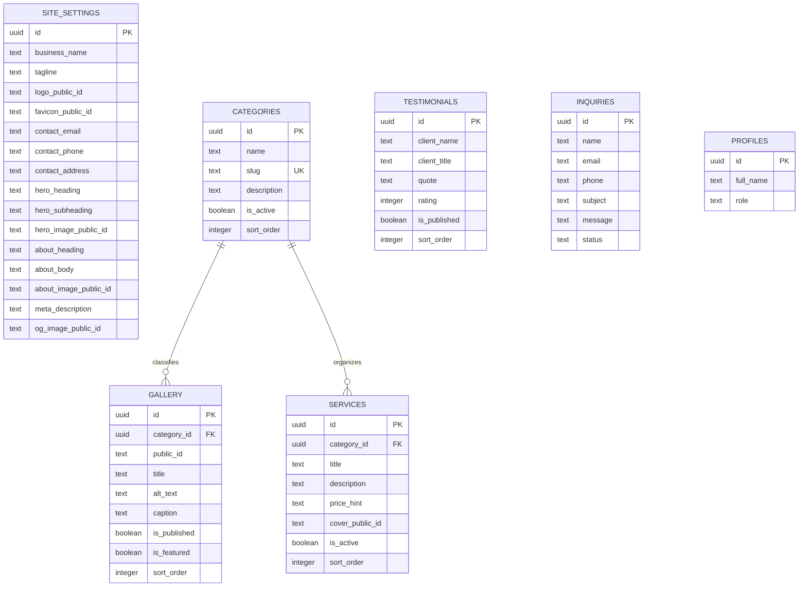

# 📸 Bala Photography — Web Platform & Admin Dashboard

> A high-performance, modern photography portfolio and booking platform built with Next.js 16, Supabase, Cloudinary, and Tailwind CSS. Fully responsive, mobile-optimized, and connected to production on Vercel.

---

## 🌟 Architecture Overview



---

## 🔄 User & Data Flow

### 1. Visitor to Customer Lead Flow



### 2. Admin Photo Upload & Management Flow



---

## 🗄️ Database Entity Relationship Diagram (ERD)



---

## ✨ Key Features & Capabilities

### 🎨 Public Experience
* **Full HD Unobstructed Hero Slideshow:** Auto-cycles published portfolio photos every 4.5s with touch-swipe support on phones and pause-on-hover. No intrusive text blocking faces.
* **Mobile-First 2-Column Gallery:** Instagram/Pinterest-style 2-column mobile layout with horizontal thumb-scroll category filter pills.
* **Instant Lightbox:** Fullscreen image zoom and preview powered by `yet-another-react-lightbox`.
* **1-Tap WhatsApp Booking:** Floating bottom-corner pulsing button and hero buttons for instant mobile bookings.
* **Dynamic OpenGraph Previews:** Link previews with custom preview photo and title when shared on WhatsApp, Facebook, or Twitter.
* **Dynamic Browser Tab Icon (Favicon):** Automatically reflects the studio logo configured in Admin Settings.

### 🔐 Studio Admin Dashboard
* **Zero-Fail Large Photo Uploader:** Built-in client-side canvas optimizer (`lib/image-compress.ts`) compresses raw 20MB DSLR files down to ~1.5MB Ultra HD in the browser, eliminating Vercel 4.5MB serverless limits.
* **Per-Section Independent Saves:** Every settings card (Business Identity, Contact, Social, Hero, About, SEO) features its own save button with instant visual checkmark feedback.
* **Visual Image Picker:** Upload new photos or choose existing photos directly from your media gallery.
* **Instant Revalidation:** Dynamic database reads and layout revalidation update the public website immediately upon save.

---

## 🛠️ Tech Stack

| Component | Technology | Description |
|---|---|---|
| **Framework** | Next.js 16 (App Router) | Turbopack compilation, React 19, Server Components |
| **Language** | TypeScript | Strict type safety across database and UI schemas |
| **Styling** | Tailwind CSS & shadcn/ui | Modern, responsive clean neutral design |
| **Database** | Supabase (PostgreSQL) | Relational store with Row Level Security (RLS) |
| **Media CDN** | Cloudinary | Delivery optimization, on-the-fly transformations |
| **Hosting** | Vercel | Automated CI/CD deployments on git push to `main` |
| **Icons** | Lucide React | Clean, scalable vector iconography |

---

## 🚀 Getting Started

### 1. Clone & Install

```bash
git clone https://github.com/DineshRocky07/photograph_prd.git
cd photograph_prd
npm install
```

### 2. Environment Configuration

Create a `.env.local` file in the root directory:

```env
# Supabase
NEXT_PUBLIC_SUPABASE_URL=https://your-project.supabase.co
NEXT_PUBLIC_SUPABASE_ANON_KEY=your-anon-key
SUPABASE_SERVICE_ROLE_KEY=your-service-role-key

# Cloudinary
NEXT_PUBLIC_CLOUDINARY_CLOUD_NAME=your-cloud-name
CLOUDINARY_API_KEY=your-api-key
CLOUDINARY_API_SECRET=your-api-secret
CLOUDINARY_UPLOAD_PRESET=balaphoto_uploads

# Site URL
NEXT_PUBLIC_SITE_URL=http://localhost:3000
```

### 3. Run Development Server

```bash
npm run dev
```

Visit `http://localhost:3000` to preview the public site, or `http://localhost:3000/admin` to access the admin portal.

### 4. Production Build

```bash
npm run build
```

---

## 📦 Deployment

Every push to the **`main`** branch on GitHub automatically triggers a zero-downtime production deployment on Vercel:

```bash
git add .
git commit -m "update features"
git push origin main
```

---

## 📄 License

Private & Proprietary — Developed for **Bala Photography**. All rights reserved.
